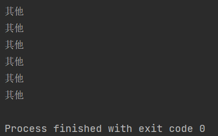
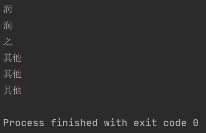
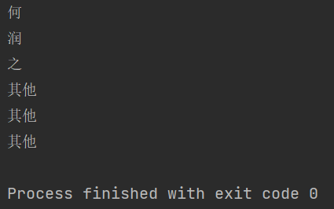

```python
Epoch 400/400
1/1 [==============================] - 0s 0s/step - loss: 7.8952e-04 - acc: 1.0000
3/3 [==============================] - 0s 667us/step - loss: 7.8579e-04 - acc: 1.0000
```

```python
Epoch 200/200
1/1 [==============================] - 0s 0s/step - loss: 0.0046 - acc: 1.0000
3/3 [==============================] - 0s 667us/step - loss: 0.0046 - acc: 1.0000
```

```python
Epoch 600/600
1/1 [==============================] - 0s 0s/step - loss: 7.9824e-04 - acc: 1.0000
3/3 [==============================] - 0s 334us/step - loss: 7.9325e-04 - acc: 1.0000
```






